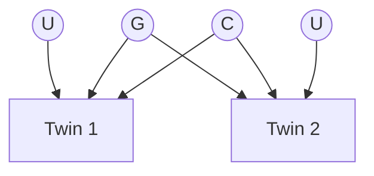
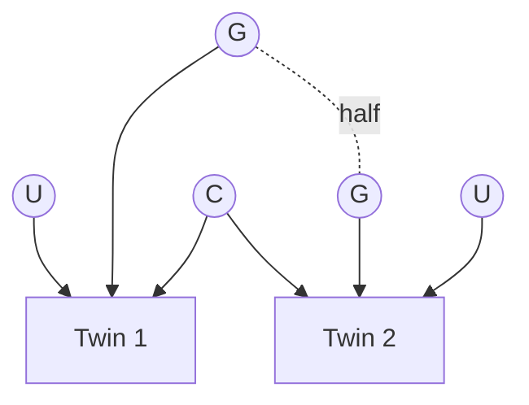
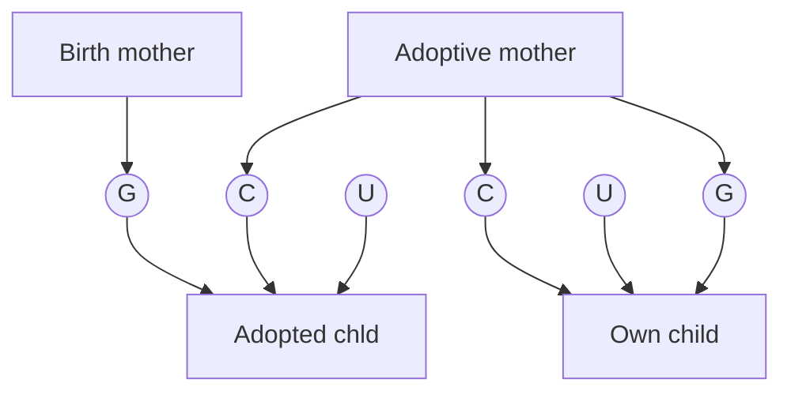

Book: [[dearyIntelligenceVeryShort2020|Intelligence: A Very Short Introduction]]

# Chapter 4

## Are intelligence differences a result of genes or environments or both?

### Dataset 7

Define $G$ as genetic, $U$ as unique environmental, and $C$ as shared environmental influences. Below is a diagram for influences on twins’ intelligence. For twins raised apart, $C$ will be separate.

*Identical*

*Fraternal*

We look at the [[Minnesota Study of Twins Reared Apart]] with $n=137$ pairs.

$r=0.69$ for identical twins raised apart.

$r=0.88$ for identical twins raised together.

>[!reminder]
>Explained variance equals correlation squared.

Particularly for Raven’s Progressive Matrices, **twins raised apart had a higher correlation than twins raised together.**

![[dearyIntelligenceVeryShort2020_04-1.png]]

*Interpretation from the graph:*

- Testing twins on IQ is almost the same as measuring the same person on IQ twice.
- Time spent with each other throughout their lives was not correlated with the score difference.

The researchers did account for how different the adoptive families were from the original ones, but it didn’t change much of the results.

**The influence of gens on intelligence grows with age.** This supposedly illogical finding was the cover of the Science magazine for 6 June 1997.

### Dataset 8

We now consider **adoptees**.

We examine the [[Texas Adoption Project]] with $n=300$ families.

$r=0.1$ between adoptive parents and adopted children.

$r=0.2$ between adoptive parents and own children.

$r=0.3$ between adopted children and birth mothers.

### Dataset 9

We examine the [[OctoTwin Project]], which analyzed twins over 80 years of age. 

![[dearyIntelligenceVeryShort2020_04-3.png]]

The bolder the line and the more pluses, the stronger the association is.

How come IQ and SES are correlated as per [[dearyIntelligenceVeryShort2020_01|Chapter 1]] but the studies analyzed here prove family environment has no causal effect on IQ? See [[Genetic confounding of the SES–IQ correlation]].
